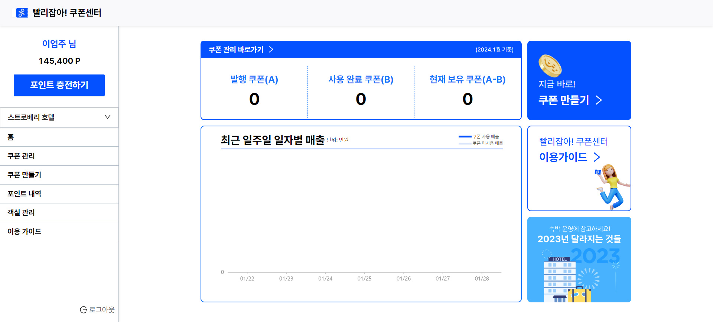
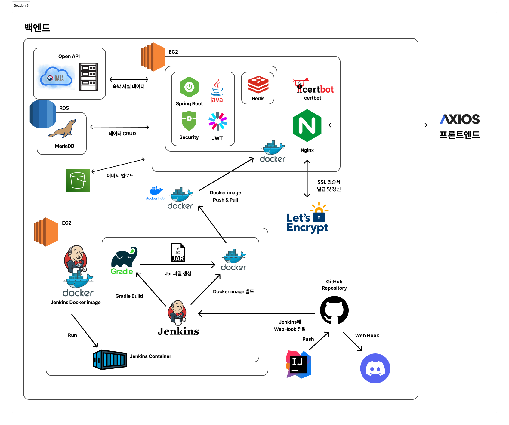

# Upjuyanolja_BE : B2B Self-coupon Admin(Backoffice) Service

---

## 0. 목차

- [1. 프로젝트 설명](#1-프로젝트-설명)
    - [🧑🏻‍💻 팀원](#-팀원)
    - [💁🏻 소개](#-소개)
    - [🎯 목적](#-목적)
    - [✨ 기능](#-기능)
    - [⏰ 개발 기간](#-개발-기간)
    - [📅 일정](#-일정)
    - [🔗 배포 링크](#-배포-링크)
- [2. 설정](#2-설정)
- [3. 설계](#3-설계)
    - [📰 아키텍처](#-아키텍처)
    - [💾 DB 설계](#-DB-설계)
    - [📡 API 설계](#-API-설계)
- [4. CI/CD](#4-cicd)
    - [🛠️ Jenkins CI/CD 아키텍처](#-jenkins-cicd-아키텍처)
- [5. API 문서](#5-API-문서)

---

## 1. 프로젝트 설명

### 🧑🏻‍💻 팀원

<table>
  </tr>
    <tr>
    <td align="center" width="150px">
      <a href="https://github.com/JeongUijeong" target="_blank">
        
      </a>
    </td>
    <td align="center" width="150px">
      <a href="https://github.com/decten" target="_blank">
        
      </a>
    </td>
    <td align="center" width="150px">
      <a href="https://github.com/chadongmin" target="_blank">
        
      </a>
    </td>
    <td align="center" width="150px">
      <a href="https://github.com/matrixpower1004" target="_blank">
        
      </a>
    </td>
    <td align="center" width="150px">
      <a href="https://github.com/chaewon12" target="_blank">
        
      </a>
    </td>
  </tr>
  <tr>
    <td align="center">
      <a href="https://github.com/JeongUijeong" target="_blank">
        정의정<br />
        BE 팀장
      </a>
    </td>
    <td align="center">
      <a href="https://github.com/decten" target="_blank">
        김현아<br />
        BE 팀원
      </a>
    </td>
    <td align="center">
      <a href="https://github.com/chadongmin" target="_blank">
        차동민<br />
        BE 팀원
      </a>
    </td>
    <td align="center">
      <a href="https://github.com/matrixpower1004" target="_blank">
        이지상<br />
        BE 팀원
      </a>
    </td>
    <td align="center">
      <a href="https://github.com/chaewon12" target="_blank">
        엄채원<br />
        BE 팀원
      </a>
    </td>
  </tr>
  <tr>
    <td align="left">
      - 서버 관리<br />
      - CI<br />
      - REST Docs<br />
      - 회원 정보 조회, 이메일 중복 검사, 로그아웃 API<br />
      - 숙소, 객실 관리 API<br />
      - S3 이미지 저장 API<br />
    </td>
    <td align="left">
      - 서브 모듈 도입<br />
      - 결제 기능<br />
      - 포인트 기능<br />
      - 숙소 예약 서비스(빨리 잡아!)의 숙소 조회 기능<br />
    </td>
    <td align="left">
      - 회원 기능<br />
      - 어드민 회원 기능<br />
    </td>
    <td align="left">
      - 쿠폰 기능<br />
    </td>
    <td align="left">
      - Jenkins CI/CD<br />
      - 예약 기능<br />
    </td>
  </tr>
</table>

### 💁🏻 소개

> 
> B2B Self-coupon Admin(Backoffice) Service

### 🎯 목적

- 빨리 잡아! 쿠폰 센터 서비스: B2B Self-coupon Admin(Backoffice) 서비스
    - B2B 고객의 자체 상품매력도와 가격경쟁력 확보: 숙소를 야놀자에서 판매하고자 하는 B2B 고객은 자신 소유의 숙소에 쿠폰 활용이 가능하게 하여 가격경쟁력을 확보합니다.
    - B2C 고객의 가격만족도 증대: 숙소를 예약하는 일반 고객은 쿠폰을 통하여 저렴한 가격으로 숙소를 이용할 수 있습니다.
    - B2B 고객의 직접 운영을 통한 내부 운영비용 절감: B2B 고객이 쿠폰을 직접 등록할 수 있는 Admin(백오피스, backoffice) 서비스를 제공하여 야놀자
      내부의 운영 비용을 절감할 수 있습니다.

- 빨리 잡아!: 숙박 예약 서비스
    - 숙박 시설 제공 및 검색: 사용자가 특정 지역이나 날짜에 필요한 숙박 시설을 쉽게 찾을 수 있도록 정보를 제공합니다.
    - 가용한 숙소 정보 제공: 사용자에게 해당 지역의 여러 숙소 옵션, 가격, 시설, 평가 등 다양한 정보를 제공하여 선택을 돕습니다.
    - 온라인 예약 및 결제: 사용자가 선택한 숙소를 신속하게 예약하고, 온라인으로 결제할 수 있는 편리한 기능을 제공합니다.

### ✨ 기능

- **빨리 잡아! 쿠폰 센터 서비스 기능** (B2B Self-coupon Admin 서비스)
    - 회원
        - 업주 회원 가입
        - 업주 회원 가입 시 이메일 인증번호 요청/검증
        - 업주 로그인
    - 숙소/객실 관리
        - 숙소 등록
        - 보유 숙소 목록 조회
        - 객실 추가 등록
        - 객실 목록 조회
        - 객실 상세 조회
        - 객실 수정
        - 객실 삭제
    - 포인트
        - 포인트 충전
        - 포인트 결제 취소
        - 포인트 요약 조회
        - 전체 포인트 내역 조회
        - 포인트 충전 내역 조회
        - 포인트 사용 내역 조회
        - 포인트 결제 취소 영수증 조회
    - 쿠폰
        - 쿠폰 만들기
        - 쿠폰 만들기 정보 조회
        - 쿠폰 추가 구매
        - 쿠폰 관리 화면 조회
        - 쿠폰 수정
        - 쿠폰 삭제
        - 쿠폰 현황 통계
        - 일자별 매출 통계
- **빨리 잡아! 서비스 기능** (숙박 예약 서비스)
    - 회원
        - 회원 가입
        - 이메일 중복 검사
        - 로그인
        - 토큰 재발급
        - 내 정보 조회
        - 로그아웃
    - 슥소
        - 숙소 목록 조회
        - 숙소 상세 조회
    - 예약
        - 예약
        - 예약 취소
        - 예약 내역 조회
        - 예약 취소 내역 조회
    - 쿠폰
        - 숙소 쿠폰 목록 조회

### ⏰ 개발 기간

- 2023-12-18 ~ 2023-01-29: 기능 개발
- 2023-01-20 ~ : 리팩토링 및 고도화

### 📅 일정

> 

### 🔗 배포 링크

- BE: https://api.couponcenter.net/docs/index.html
- FE
    - 빨리 잡아! 쿠폰 센터 (B2B Self-coupon Admin 서비스): // TODO 배포 후 업데이트
    - 빨리 잡아! (숙소 예약 서비스): https://fast-catch-front-end-gold.vercel.app/

### 🪄 실행 가이드

1. Clone 받는다.

```shell
git clone https://github.com/Upjuyanolja/Upjuyanolja_BE.git
cd Upjuyanolja
```

2. 설정 파일을 작성한다.

> `application.yaml`
>
> ```java
> spring:
>   profiles:
>     active: local

> `application-local.yaml`
> ```java
> spring:
>   config:
>     activate:
>       on-profile: local
>   datasource:
>     driver-class-name: org.mariadb.jdbc.Driver
>     url: jdbc:mariadb://localhost:3307/upjuyanolja?createDatabaseIfNotExist=true&serverTimezone=Asia/Seoul
>     username: ${DB_USERNAME}
>     password: ${DB_PASSWORD}
>   jpa:
>     hibernate:
>       ddl-auto: update
>     show-sql: true
>     properties:
>       hibernate:
>         default_batch_fetch_size: 100
>   data:
>     redis:
>       host: localhost
>       port: 6379
> 
>   mail:
>     host: smtp.gmail.com
>     port: 587
>     username: ${MAIL_URERNAME}
>     password: ${MAIL_PASSWORD}
>     properties:
>       mail:
>         smtp:
>           auth: true
>           starttls:
>             enable: true
>             required: true
>           connectiontimeout: 5000
>           timeout: 5000
>           writetimeout: 5000
>     auth-code-expiration-millis: ${CODE_EXPIRE_TIME}
>   servlet:
>     multipart:
>       maxFileSize: 10MB
>       maxRequestSize: 30MB
> 
> jwt:
>   secret: ${JWT_SECRET}
>   access-token-expire-time: ${ACCEESS_TOKEN_EXPIRE_TIME}
>   refresh-token-expire-time: ${REFRESH_TOKEN_EXPIRE_TIME}
> 
> open-api:
>   service-key: ${API_SERVICE_KEY}
> 
> coupon:
>   constraints:
>     min-flat-amount: 1000
>     max-flat-amount: 50000
>     min-discount-rate: 1
>     max-discount-rate: 50
>     day-limit: -1
> 
> point:
>   toss:
>     url: https://api.tosspayments.com/v1/payments/
>     secret-key: ${TOSS_SECRETE_KEY}
>
> cloud:
>   aws:
>     s3:
>       bucket: coupon-center-bucket
>     credentials:
>       access-key: ${S3_ACCESS_KEY}
>       secret-key: ${S3_SECRET_KEY}
>     region:
>       static: ap-northeast-2
>       auto: false
>     stack:
>       auto: false
>

3. Docker 컨테이너 실행

```shell
docker-compose up --build -d
```

4. Run

```shell
gradle test
gradle build
gradle bootJar
```

5. 테스트 계정

- 업주
    - email: yowner@gmail.com
    - password: Qwer1234
- 회원
    - email: yuser@gmail.com
    - password: Qwer1234

---

## 2. 설정

- 자바 버전: 17
- 스프링 버전: 6.1.1
- 스프링 부트 버전: 3.2.0
- 의존성
    - Spring Web
    - security, JWT
    - Lombok
    - Spring REST Docs
    - Spring Data Jpa
    - Spring Data Redis
    - Validation
    - QueryDSL
    - Json
    - Jasypt
    - Spring Mail
    - Spring Cloud
- `application.yaml`, `applicaion-local.yaml`, `application-prod.yaml`, `.env` 파일은 LMS에서 확인하실 수
  있습니다!

---

## 3. 설계

### 📰 아키텍처

> 

### 💾 DB 설계

`ERD`
> 

### 📡 API 설계

[Spring REST Docs](#API-문서)를 통해 확인하실 수 있습니다.

---

## 4. CI/CD

### 🛠️ Jenkins CI/CD 아키텍처

> 

---

## 5. API 문서

※ Spring REST Docs로 문서화했습니다.
https://api.couponcenter.net/docs/index.html
